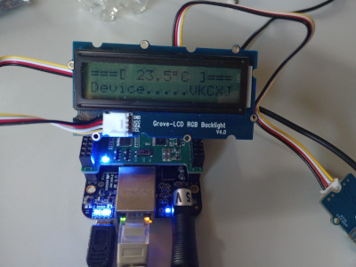
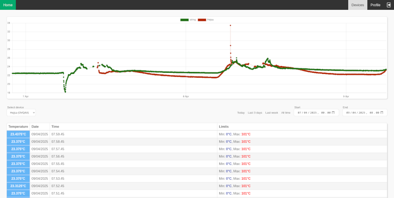

# Temperature Alarm

## Setup

In the `backend/Api` folder, copy `appsettings.example.json` into `appsettings.json` and fill out the values.

In the `frontend` folder, copy `shared/constants.example.js` into `shared/constants.js` and fill out the values.

In the `iot` folder, copy `config.example.h` into `config.h` and fill out the values.

## Running

To run the backend, type `dotnet run` within the `backend/Api` folder. Make sure you have the .NET 8 SDK installed.

The frontend should just be hosted with a static web server. To run locally, you may e.g. use PHP: `php -S 0.0.0.0:80`

The IoT code should be run on a BeagleBone Black with:

- A Grove Base Cape, set to 5V
- A JHD1313 Grove-LCD RGB Backlight display in one of the I2C\_2 ports
- An MCP9808 Grove High Accuracy Temperature Sensor in one of the I2C\_2 ports
- A Grove Buzzer in the GPIO\_51 port

The following library packages are required by the IoT code and should be installed on the BeagleBone:

`apt install libmosquitto-dev librabbitmq-dev libi2c-dev libgpiod-dev libcjson-dev`

> [!NOTE]
> The RabbitMQ apt package is missing the header files - They can be copied from [here](https://github.com/alanxz/rabbitmq-c/tree/master/include/rabbitmq-c) into the `/usr/include/rabbitmq-c` folder

Copy the source files onto the BeagleBone and run the following command to compile and run the code:

`make && ./a.out`

To run in the background, a program such as GNU Screen can be used.

